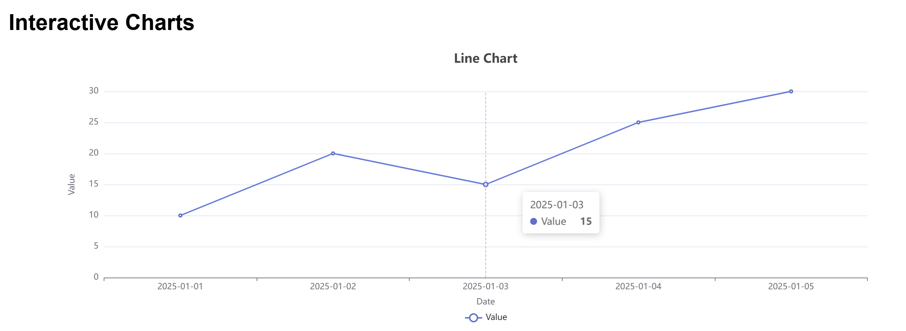
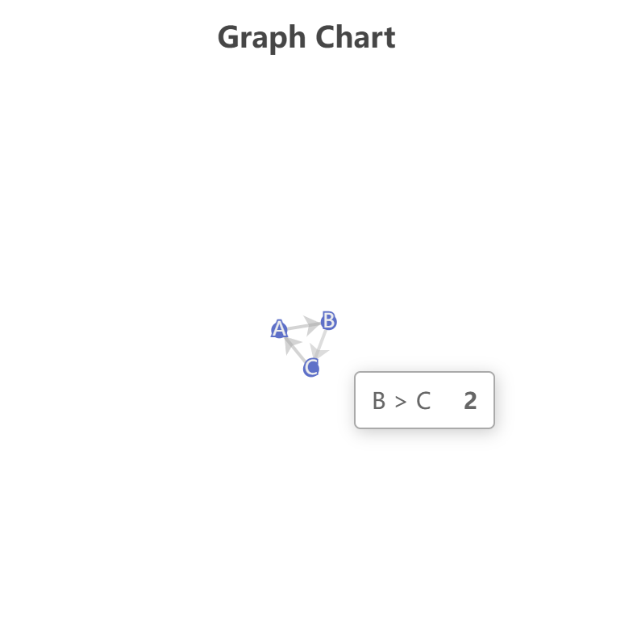
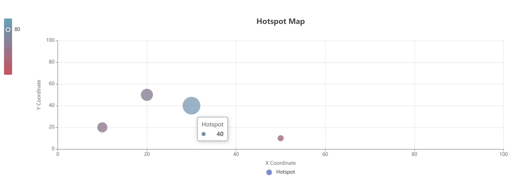

# Interactive DB Charts App

A web application showcasing a line chart, graph, and hotspot map using FastAPI, SQLite, Neo4j, MongoDB, and Apache ECharts.

## Prerequisites
- Docker
- MongoDB
- Neo4j

## Setup
1. Clone the repository:
   ```bash
   git clone https://github.com/pjlau/interactive-db-charts-app
   cd interactive-db-charts-app
2. Run the Docker:
   ```bash
   docker-compose up --build
3. Access the webpage through `http://localhost:5173`.
4. Access the backend through `http://localhost:8000`.

## Results

<br>

<br>

